# A.T.L.E. — Automation Architecture (PROPOSAL — approve before anything is wired)

> **STATUS: 🟠 PROPOSAL / AWAITING CARTER'S APPROVAL. Nothing in this document is built,
> connected, or running.** It is the map to look at *before* we wire anything live. On your
> approval we build it in phases; each phase names exactly what it needs from you.

**Design goal (your instruction):** automate content generation, publishing/uploading,
marketing, design, and scheduling so that **your review is the ONLY manual step** across the
whole company.

---

## The one principle everything is built around

```
IDEA  →  DRAFT (Claude/CC)  →  ┌─────────────────┐  →  PUBLISH & DISTRIBUTE (automated)  →  MEASURE
                              │  REVIEW = CARTER  │
                              │  (the only gate)  │
                              └─────────────────┘
```

Everything **left** of the gate is automated drafting. Everything **right** of the gate is
automated publishing/distribution. **You touch exactly one thing: the approve/reject queue.**
The existing brand guardrails stay hard-wired into "DRAFT" (Divine Archives factual grounding +
"The Divine Archives" title on every piece; Pip character-consistency + quote-bank; sacred-symbol
respectful-use gate) so nothing off-brand ever reaches your queue.

---

## Flow map

```mermaid
flowchart LR
  subgraph IDEA[Idea backlog]
    B1[DA chapter backlog]
    B2[Pip quote-bank ~125]
    B3[PDF topic list]
    B4[Merch product list]
  end

  subgraph DRAFT[Draft · Claude Code agents]
    D1[DA chapter drafter]
    D2[Pip card composer]
    D3[PDF drafter]
    D4[Merch brief/copy drafter]
  end

  subgraph GATE[REVIEW · Carter — ONLY manual step]
    Q[Approve / reject queue<br/>surfaced in the Dashboard]
  end

  subgraph PUB[Publish & distribute · automated on approval]
    P1[git → GitHub Action → Cloudflare Pages]
    P2[Printify API → Shopify product → /shop redeploy]
    P3[Social scheduler → TikTok/YT/FB/IG]
    P4[PDF build → site/store listing]
  end

  subgraph MEASURE[Measure]
    M1[Analytics]
    M2[Shopify/Printify sales webhooks]
  end

  IDEA --> DRAFT --> GATE --> PUB --> MEASURE --> IDEA
```



---

## The agent / tool map (what does what)

| # | Node | Type | Runs where | Does what | Build status |
|---|---|---|---|---|---|
| 1 | **DA chapter drafter** | Claude Code | scheduled/on-demand | Drafts a chapter to spec (grounded, evidence-honesty, title on every piece) → `status: draft` | exists as manual CC; automate trigger |
| 2 | **Pip card composer** | Claude Code | scheduled | Picks a quote from `quote-bank.md` + writes the card spec/caption → draft | new (thin) |
| 3 | **PDF drafter** | Claude Code | on-demand | Drafts a survivability/how-to PDF from your topic list | new (needs topic list) |
| 4 | **Merch drafter** | Claude Code | on-demand | Fills briefs/copy, wires product data | exists (05-merch) |
| 5 | **Review queue** | Dashboard doc + status flags | repo | Single place you approve/reject; sets `approved` | new (this proposal ships the doc) |
| 6 | **DA publisher** | GitHub Action | CI | On approved DA items: build + deploy | **already live** (`deploy.yml`) |
| 7 | **Merch publisher** | GitHub Action + Printify/Shopify API | CI | Create/update Printify product → Shopify → paste Buy Button → redeploy `/shop` | new |
| 8 | **Social distributor** | SaaS scheduler (Buffer/Metricool/Later) API | external | Queue approved Pip cards to a posting calendar; auto-post | new (SaaS acct) |
| 9 | **Fulfilment** | Shopify↔Printify native + webhooks | external | Order → Printify prints/ships automatically; status → dashboard | native, needs accounts |
| 10 | **Link-checker** | GitHub Action (cron) | CI | Guards DA citation link-rot | new (small) |
| 11 | **Analytics + metrics** | privacy-friendly analytics + sales webhooks | external → dashboard | Feeds results back to the idea backlog | new |

**Deliberately NOT proposed:** a heavyweight "orchestrator agent." The orchestration is just
(status flags + the dashboard + a couple of cron GitHub Actions + Claude Code on triggers). Lean
stays lean; we add an orchestrator only if throughput ever demands it.

---

## Phased rollout (each phase = one approval + what it needs from you)

| Phase | What gets wired | Needs from Carter (founder-only) | CC builds |
|---|---|---|---|
| **0 — now** | Rename done · Dashboard doc · this proposal | Approve this map | ✅ shipped |
| **1 — Commerce spine** | Printify+Shopify live, 10 products listed, `/shop` Buy Button + deploy, store link in Pip bios | **Entity/EIN · payment processor · Printify + Shopify accounts** (your 3 items) + pricing/SKUs | product wiring, `/shop` deploy, merch publisher |
| **2 — Distribution** | Social scheduler connected; Pip card pipeline draft→queue→schedule | pick + connect a scheduler (API key) | Pip composer + scheduler push |
| **3 — Content pipeline** | Scheduled CC drafting + "publish-approved" Action; PDF pillar starts | **PDF topic list** (your 4th item) | drafters on triggers, publish-approved job, link-checker |
| **4 — Measurement** | Analytics + sales metrics → dashboard; email capture/list | pick analytics + email tools | instrument + dashboard metrics |

---

## Secrets / accounts the automation will need (least-privilege, stored as GH Actions secrets)
- **Cloudflare** — already set (`CLOUDFLARE_API_TOKEN`, `CLOUDFLARE_ACCOUNT_ID`).
- **Shopify** — Admin API token (products, orders) — *Phase 1*.
- **Printify** — API key + shop ID — *Phase 1*.
- **Social scheduler** — API key/OAuth — *Phase 2*.
- **Analytics / email** — keys — *Phase 4*.
Every key is created by you (founder list) and scoped to the minimum needed; nothing broadens the
review gate.

## Guardrails (non-negotiable, carried from the existing stages)
- The **review gate stays mandatory** — no path auto-publishes without an `approved` flag you set.
- **Brand gates stay in DRAFT:** DA factual grounding + title-on-every-piece; Pip character
  consistency + quote bank; sacred-symbol respectful-use sign-off. Off-brand items never reach you.
- **No destructive/irreversible action** (charging customers, posting publicly, listing products)
  happens without an approved item behind it.

---

## What I need back from you
1. **Approve the map** (or redline it) — then I build **Phase 1** and stop for the next approval.
2. Confirm the **social scheduler** preference (Buffer / Metricool / Later / other) for Phase 2.
3. Confirm **analytics/email** preference (e.g. Plausible + a list tool) for Phase 4.

*Nothing is wired. This is the review copy of the architecture.*
