# Founder guide — The Divine Archives, section by section

*Written 2026-10-01 for Carter. Plain language. Every screenshot was taken on a simulated
phone screen 390 pixels wide (iPhone size), from the current version of the site.*

**How to read this:** each section says what it is, who it's for, how many taps it takes to
reach from the home page, and whether it is **working**, **partial** (works, with a real
problem) or **broken**. "Scroll" means the visitor has to scroll down before tapping.

**How it was checked:** each page was opened in a headless browser on a simulated phone. I
looked for errors, for pages wider than the screen, and for missing files. None of the pages
below had a script error or ran wider than the screen. Two things could not be checked from
here, because this computer can't reach outside websites: the live getconexto.com itself, and
the museum and library scans that the Vault pulls in from other sites. The site's own
lettering (Google Fonts) was also blocked here, so the screenshots use a stand-in typeface.

---

## At a glance

| Section | State | Taps from home |
|---|---|---|
| Home page | working | 0 |
| Eras (the nine ages) | working | 1 (scroll) |
| One era's page | working | 1 (scroll) |
| Traditions | working | 1 (scroll) |
| Themes | working | 1 (scroll) |
| Compare, side by side | partial | 2 |
| A chapter | working | 2 |
| A chapter at random | **broken on the live site** (fixed on this branch) | 1 (scroll) |
| Search | working | 1 + typing |
| The Pantheon | working | 1 (scroll) |
| The Vault | working | 1 (scroll) |
| A Vault entry | working (outside scans unverified) | 2 |
| The Museum | working (beta) | 2 |
| The Symbols | partial | 1 (scroll) |
| The 12 games | all open and play; 4 are slow on phones | 2 |
| Methodology and About | working | 1 (long scroll) |
| Email sign-up (home page) | **not working yet** (switched off) | 0 (scroll) |
| Sitemap | working, one gap | not for people |
| "Page not found" | working | — |

---

## Home page

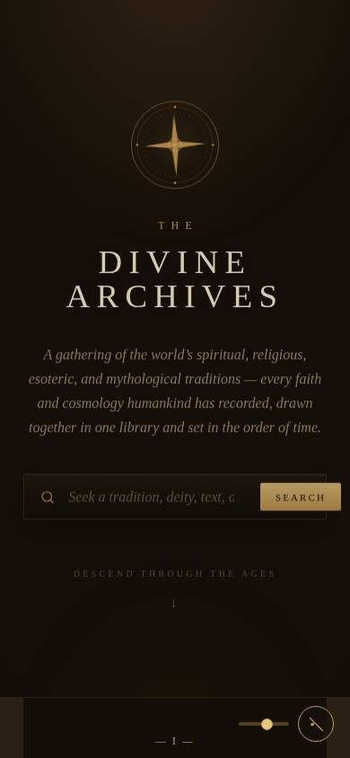

- **What it is:** the front door. The title, one sentence about the archive, and a search box.
  Further down: eight "ways to explore" (Era, Tradition, Themes, Symbols, Vault, Pantheon,
  Museum, Arcade), the games, a timeline of the nine ages, the method, an email sign-up and a
  "support the archive" link.
- **Who it's for:** everyone. A newcomer needs it to tell them what this is and where to start.
- **Taps:** 0.
- **State: working.** The first screen shows only the title, the sentence and the search box.
  The eight ways in start below the fold (next picture). The faint "Descend through the ages"
  hint is easy to miss.

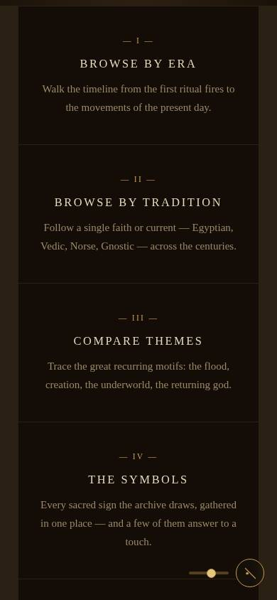

## Eras (the nine ages)

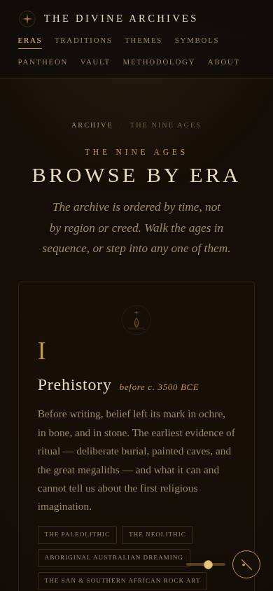

- **What it is:** the archive's backbone, nine ages from Prehistory to the Modern Age, each with
  its dates and a short description.
- **Who it's for:** readers who think in history and want "what did people believe *then*".
- **Taps:** 1, after a scroll ("Browse by Era").
- **State: working.**

## One era's page

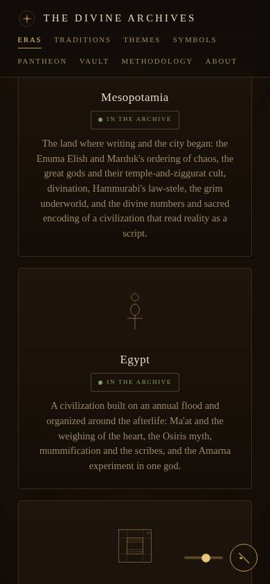

- **What it is:** one age, with a card for every tradition in it, the cross-era themes, and
  that age's objects from the Vault.
- **Who it's for:** browsers who picked an age.
- **Taps:** 1 from the timeline on the home page (after a scroll), or 2 through Eras.
- **State: working.** All 83 chapters now appear on their era pages (the 18 newest were
  missing until the 2026-09-30 fix).

## Traditions

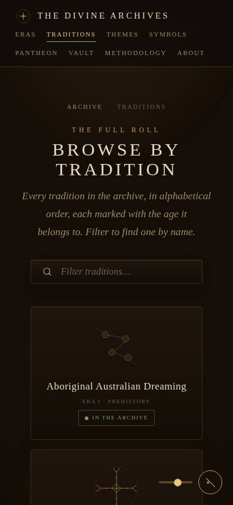

- **What it is:** every tradition A–Z, each linking to its chapter.
- **Who it's for:** people who arrive with a name in mind ("Sufism", "Norse").
- **Taps:** 1, after a scroll ("Browse by Tradition").
- **State: working.** It is a long list (76 entries) with no letter jump on phones.

## Themes

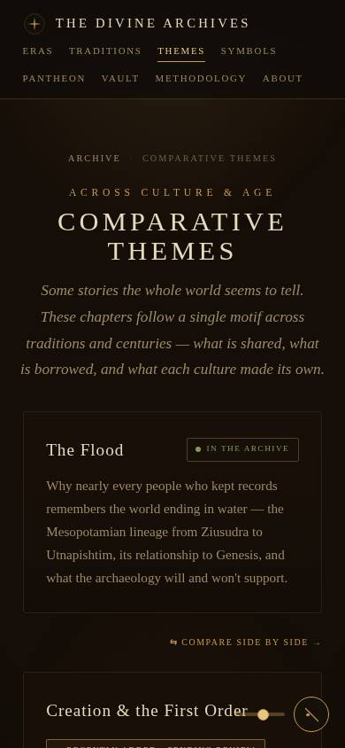

- **What it is:** the seven cross-era chapters (the Flood, Creation, the Underworld, the Great
  Goddess, Sacred Kingship, the End of Days, Sacrifice).
- **Who it's for:** comparative readers, the "why does every culture have a flood story" crowd.
- **Taps:** 1, after a scroll. The home page calls it "Compare Themes".
- **State: working.**

## Compare, side by side

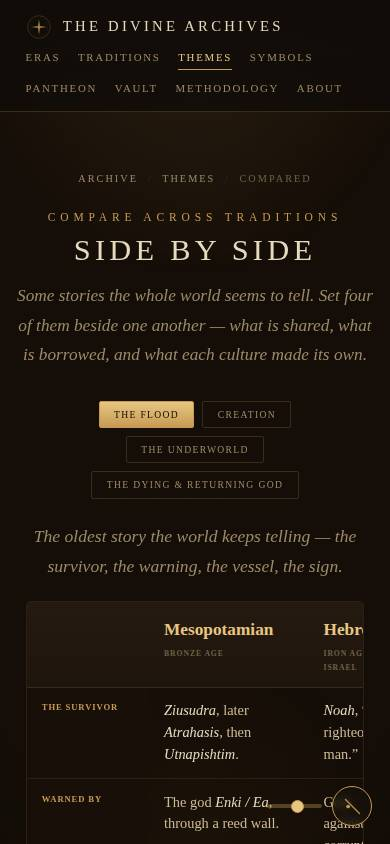

- **What it is:** four stories (Flood, Creation, Underworld, Dying-and-returning god) laid out
  in a table across traditions.
- **Who it's for:** the same comparative readers; good for teachers.
- **Taps:** 2 (Themes, then a "compare" link), or 1 from the home page footer.
- **State: partial.** On a phone the table is wider than the screen. The second column is cut
  off at the edge, and nothing tells you to swipe sideways.

## A chapter

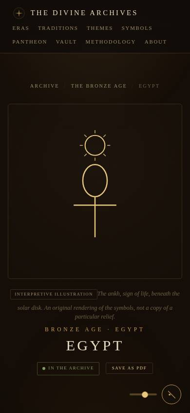
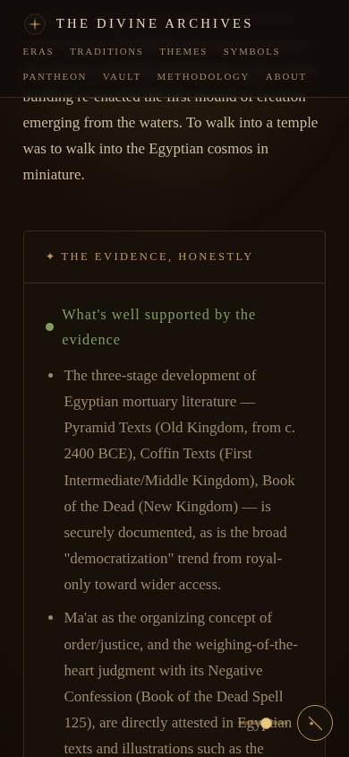

- **What it is:** the heart of the archive. One tradition, in a long, sourced narrative, ending
  in "The evidence, honestly" (supported / not supported / still open) and a list of sources.
- **Who it's for:** readers who want depth they can trust.
- **Taps:** 2 (an age, then a chapter).
- **State: working.** On a phone, the top-of-page menu takes two lines and stays on screen as
  you scroll. The chapter's picture then fills most of the first screen, so the chapter's
  **title only appears at the very bottom** of the first view.

**Pending chapters** carry a visible "Recently added · pending review" badge under the title:

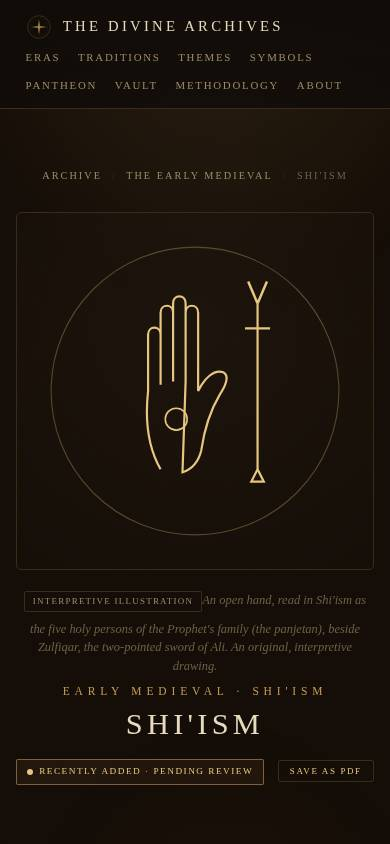

## A chapter at random

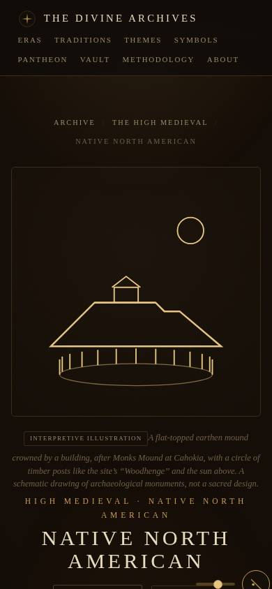

- **What it is:** "Open a chapter at random", on the home page.
- **Who it's for:** the curious, and returning visitors.
- **Taps:** 1, after a scroll.
- **State: broken on the live site; fixed on this branch.** It chose from everything in the
  search index (chapters, Vault objects, Pantheon figures) but always sent you to a *chapter*
  address. **About 3 taps in 4 landed on "This leaf is missing from the codex"** (30 of 40 in my
  test). The fix makes it pick only chapters (0 of 40 failed). It goes live when this branch is
  merged.

## Search

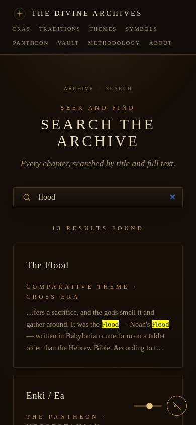

- **What it is:** search across chapters, Vault objects and Pantheon figures, with the match
  highlighted. "flood" finds 13 results.
- **Who it's for:** anyone with a specific question.
- **Taps:** type in the box on the home page's first screen, then 1 tap.
- **State: working.**

## The Pantheon

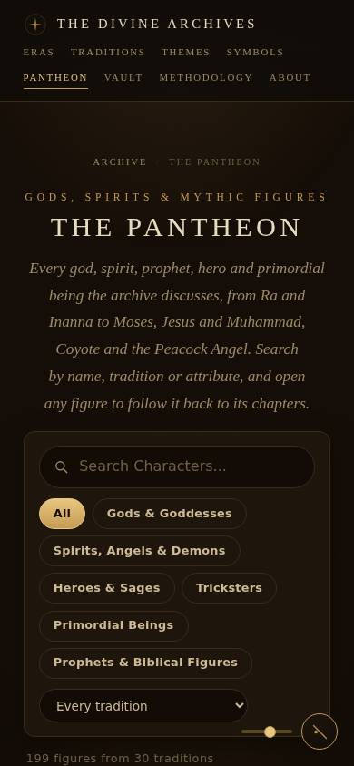

- **What it is:** 199 gods, spirits, heroes and prophets from 30 traditions, with a search box
  and filters. Each figure links back to its chapters.
- **Who it's for:** myth fans, gamers, students looking up one name.
- **Taps:** 1, after a scroll.
- **State: working.** None of the 18 newest chapters has figures in it yet (on hold until
  Batch V is scoped).

## The Vault

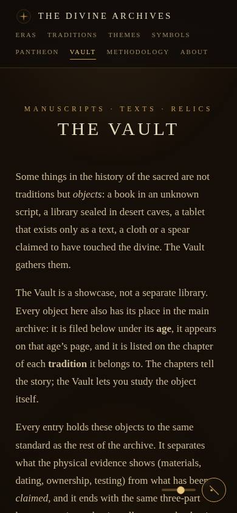
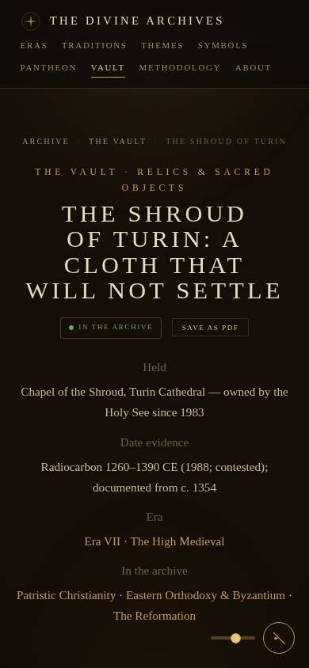

- **What it is:** 88 famous objects and texts (the Shroud of Turin, the Dead Sea Scrolls, the
  Voynich Manuscript…). Each gets its own study page: dates, who holds it, what is contested,
  and the holding museum's own scans where they exist.
- **Who it's for:** the "mysterious objects" audience, the most shareable part of the site.
- **Taps:** 1 to the Vault (after a scroll), 2 to an entry.
- **State: working.** The scans are loaded live from the museums' and libraries' own servers. I
  could not check that from here, so that part is **unverified**.

## The Museum (beta)

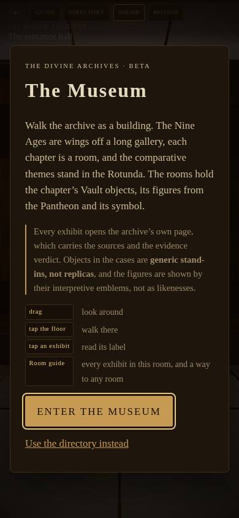

- **What it is:** a 3D building you walk through. Nine wings for the nine ages, one room per
  chapter (83 rooms), and a planetarium. Exhibits open the archive's pages.
- **Who it's for:** visitors who like to explore, and showing the project off.
- **Taps:** 2 (Museum, then "Enter the museum").
- **State: working (beta).** It loads on the simulated phone and the pages behind it check out.
  **Your real-phone check is still the missing piece.** The welcome card also offers "Use the
  directory instead", a plain list for phones that struggle.

## The Symbols

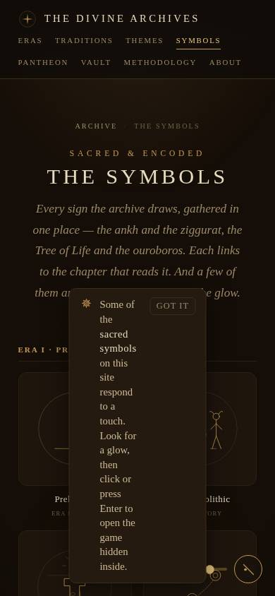

- **What it is:** every sacred sign drawn on the site, by age. Twelve of them hide a game.
- **Who it's for:** browsers and puzzle-lovers.
- **Taps:** 1, after a scroll.
- **State: partial.** On a phone the "Some of the sacred symbols respond to a touch" tip opens
  as a narrow box, one or two words per line, covering the page until you tap "Got it". It
  works, but it looks broken.

## The games (12)

All twelve open inside the Symbols page. The home page's **Arcade** links straight to each.
**Taps: 2** (the Arcade, then a game). Then 1–2 more on the game's own start screen (for
example, pick a god, then "To the arena").

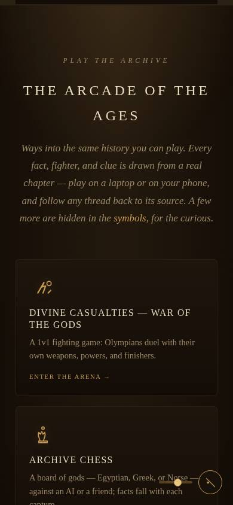

Every game opened and started on the simulated phone with no errors. "Slow on phones" below
comes from the frame-rate test in [`perf-baseline.md`](perf-baseline.md). Read those numbers
as a comparison between the games, not as exact phone speeds.

| Game | What it is | Who it's for | State |
|---|---|---|---|
| **Divine Casualties** | Gods' 1-on-1 fighting game (Zeus, Poseidon, Athena, Hades) | action gamers | working, **slow on phones**, and a 6 MB download |
| **Archive Chess** | Chess with pantheons as the pieces; captures reveal facts | strategy players | working |
| **Ouroboros** | Snake: the serpent eats facts | casual | working |
| **Ziggurat Builder** | Tetris-style: build a temple-mountain | casual | working |
| **The Reliquary** | Trivia drawn from the chapters, filter by era/tradition | quiz lovers, students | working |
| **The Seeker's Path** | Ten riddles, each answered somewhere in the archive | puzzle lovers | working |
| **Antithesis** | Pong: Order vs Chaos | casual | working, a little slow on phones |
| **The Excavation** | Minesweeper: dig a site | casual | working |
| **The Labyrinth** | Pac-Man through the underworld | casual | working, **slow on phones** |
| **The Firmament** | Pinball in the heavens | casual | working, **slow on phones** |
| **Dominion of the Ancients** | Risk-style conquest of the ancient world | strategy players | working; the page freezes for about 1.5 s while it loads |
| **The Tomb Robber** | Platformer across four ancient sites | action gamers | working, **slowest on phones** |

Screenshots of each game's first screen:

| | | |
|---|---|---|
| 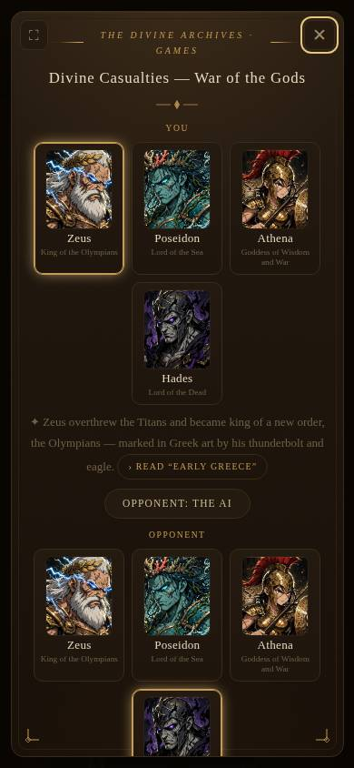 | 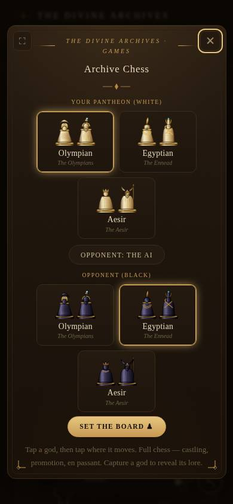 | 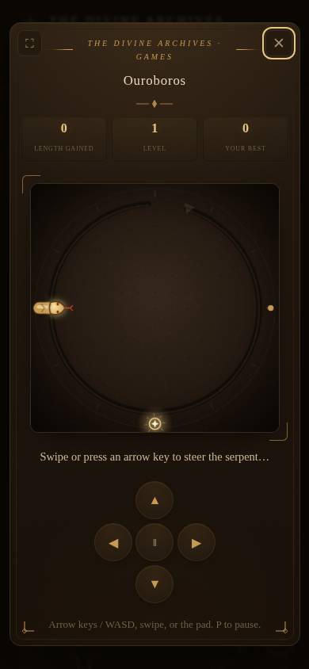 |
| 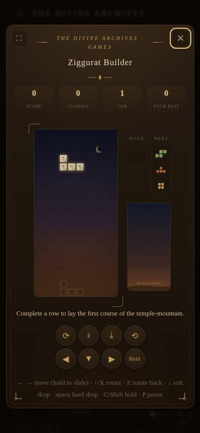 | 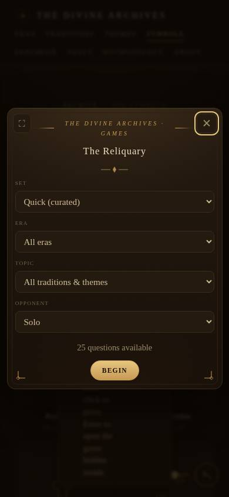 | 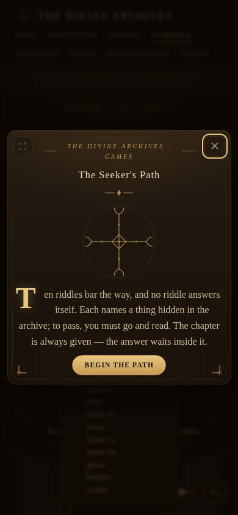 |
| 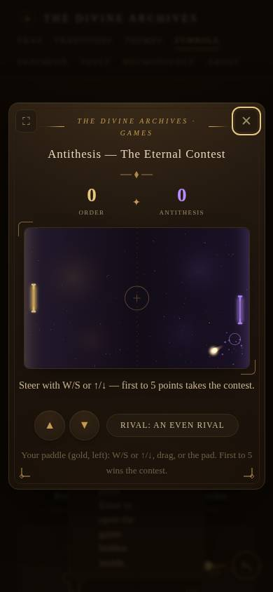 | 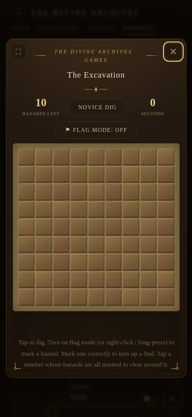 | 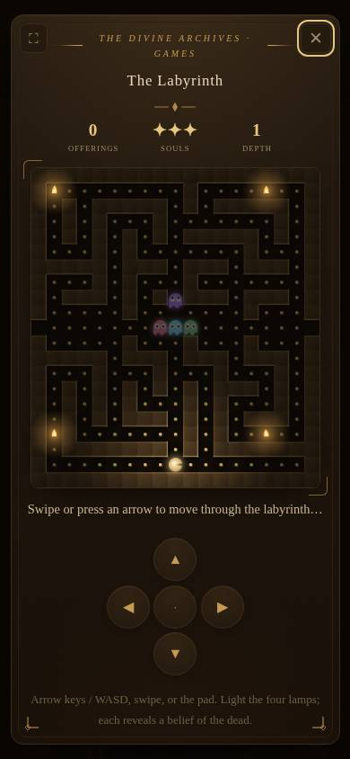 |
| 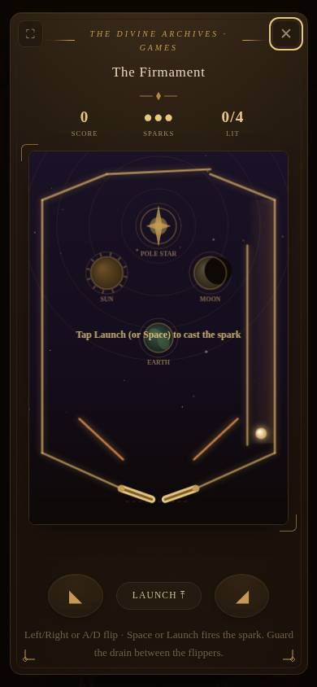 | 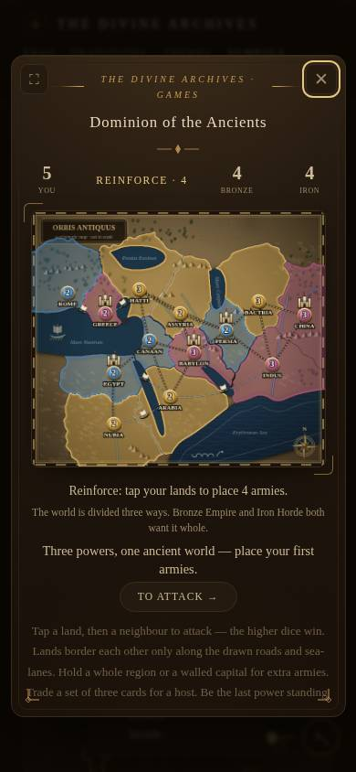 | 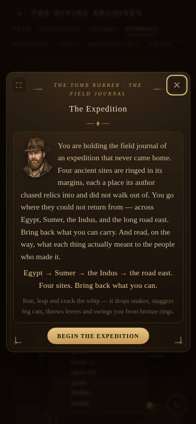 |

## Methodology and About

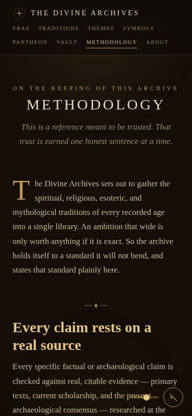

- **What it is:** Methodology is the sourcing rules and what "pending review" means. About is
  who's behind the archive and why.
- **Who it's for:** skeptics, teachers, journalists: anyone deciding whether to trust the site.
- **Taps:** 1, after a long scroll (home page footer). From any inner page, 1 tap in the top
  menu.
- **State: working.**

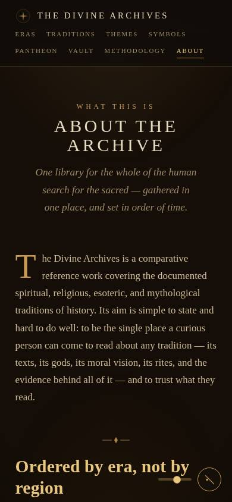

## Email sign-up (on the home page)

- **What it is:** "Leave your email and I'll send word when a new chapter goes up."
- **State: not working yet, on purpose.** It needs a storage space switched on in Cloudflare.
  Until then, anyone who tries it is told "The list isn't open just yet", after being invited
  to join. Either switch it on or hide it (both need your OK; Cloudflare is on your approval
  list).

## Sitemap

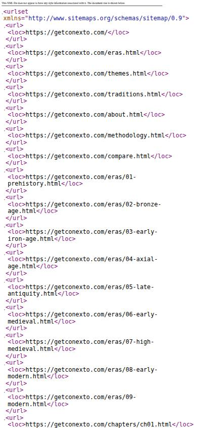

- **What it is:** a machine-readable list of pages for Google and other search engines (189
  addresses). People never see it. `robots.txt` points search engines to it.
- **State: working, one gap.** It lists every chapter, era and Vault entry and the main
  listings. It leaves out the **Symbols page, where all twelve games live**, so search engines
  can't find the games. The Museum is left out on purpose.

## "Page not found"

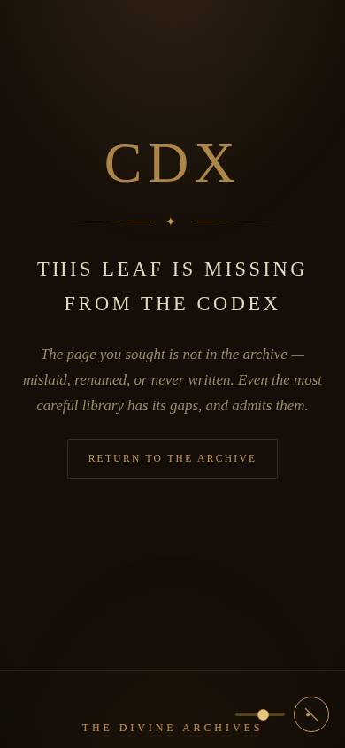

- "This leaf is missing from the codex", with a button back to the archive. **Working.**

---

## What a stranger sees in their first 60 seconds (on a phone)

**0–5 s.** The page opens dark and gold: a compass-star emblem, **THE DIVINE ARCHIVES**, and one
sentence: *"A gathering of the world's spiritual, religious, esoteric, and mythological
traditions… set in the order of time."* There's a search box and nothing else. It loads fast
(Lighthouse scores it 100). It looks serious and beautiful, but nothing yet says *what I can
do here*: there's no menu and no buttons on the first screen apart from search.

**5–15 s.** They scroll. Eight large panels appear one at a time, each a full screen tall:
Browse by Era, Browse by Tradition, Compare Themes, The Symbols, The Vault, The Pantheon, The
Museum, The Arcade. Each has a one-line description. The most intriguing hooks (the Vault's
"Voynich Manuscript, Dead Sea Scrolls", the Museum, the games) are the 5th, 7th and 8th
panels, several thumb-swipes down. A small gold slider and round button float in the corner.
These are the background-music control, but nothing says so, and they sit on top of the text.

**15–35 s.** Say they tap **The Vault** and then **the Shroud of Turin**. They get a big title,
"A cloth that will not settle", the facts at a glance (who holds it, the 1988 carbon date,
marked *contested*), and links to the chapters. It feels authoritative and honest. A
two-line menu (Eras, Traditions, Themes, Symbols / Pantheon, Vault, Methodology, About) stays
pinned to the top of the screen and takes about a fifth of it.

**35–50 s.** They go back and try **Open a chapter at random**. On the live site today, three
times out of four this lands on **"This leaf is missing from the codex"**, an error page. A
newcomer reads that as "this site is broken." (Fixed on this branch, not yet live.)

**50–60 s.** If they open a chapter instead, they see the menu, a large symbol drawing, a
caption, and then, at the bottom of the screen, the chapter's title. The writing itself is
strong. A small "pending review" badge on new chapters is honest but unexplained at that
point. By the one-minute mark they know it's a serious, beautiful library. They may not yet
know there's a 3D museum and twelve games unless they kept scrolling.

## Top 5 friction points (honest)

1. **"Open a chapter at random" fails about 3 times in 4** with an error page, on the live site
   today. It's the cheapest way to make a first impression of "broken". *Fix ready on this
   branch; it needs your OK to merge.*
2. **The first screen doesn't show what's inside.** There's no menu and no buttons on it. The
   best hooks (Vault, Museum, games) are 5–8 full-screen panels down. A short strip of 3–4
   inviting links on the first screen would fix most of this.
3. **The floating music control sits on top of the text on every page,** in the bottom-right
   corner, and it isn't labelled. On a phone it covers words in the chapters and the games'
   instructions.
4. **The games are slow on mid-range phones,** most of all the Tomb Robber, the fighter, Pac-Man
   and pinball. The fighter is also a 6 MB download, and the Risk game freezes the page for
   about 1.5 s while it opens. The cause and the cheapest fixes are in
   [`perf-baseline.md`](perf-baseline.md).
5. **Small rough edges that read as unfinished:**
   - the cramped "symbols respond to a touch" tip;
   - the Compare table cut off at the screen edge;
   - the chapter title appearing only at the bottom of the first screen;
   - the email sign-up that invites you to join and then says it isn't open.
