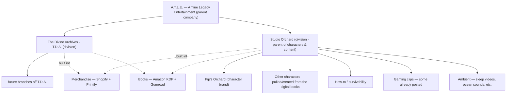

# A.T.L.E. — Control Dashboard

**A True Legacy Entertainment** · the parent company. This is the **single page you check.**
Your review is the only manual step; everything else is (being) automated. Updated 2026-08-19.

> New here? 5-minute catch-up: `00-audit/atle-restructure-audit.md` §4 (CEO Map).
> Automation plan awaiting your approval: `00-audit/atle-automation-proposal.md`.

---

## 🏛️ A.T.L.E. org structure (canonical — Carter 2026-08-19)

Two divisions under the parent; **Studio Orchard** is the parent of the characters + content
lines (this resolves the earlier "Studio Orchard vs Pip's Orchard" flag — they're different tiers).
**Merch + books are cross-cutting monetization** built off everything above them.

**Account mapping (from the confirmed handles):** `@studioorchard-q5r` (YouTube) +
`studioorchard94@gmail.com` = the **Studio Orchard division** (hosts all the content lines);
`@pips.orchard` (TikTok) = the **Pip's Orchard character**. Which tier the Facebook page and
`clipyield26@gmail.com` belong to is still to confirm.

---

## 🔴 Founder-only to-do (nothing else needs you)
The confirmed list — these unblock everything downstream:
- [ ] **1. Business entity + EIN** (+ business bank) — also unblocks KDP verification
- [ ] **2. Payment processor** (needs #1) — **Stripe:** confirm a fresh account (old one is on Polsia);
      **PayPal:** gather + clear its specific blocker
- [x] **3. Shopify store + Printify** — ✅ stack confirmed (storefront + fulfilment, per-brand
      collections). *Remaining:* pricing/SKUs + list the 10 products (no products live yet)
- [ ] **4. PDF library topic list** (hand to CC — Gumroad is the confirmed home)

*30-second check (not urgent):* **ICM Batch I** — those Divine Archives chapters show as
`published` on the live site, but the batch doc (`icm/BATCH-I-READY-FOR-REVIEW.md`) still reads
"awaiting approval." Confirm the gate was cleared (doc is stale) vs. something skipped review.
I left the doc unchanged pending your word.

---

## 🔎 Verified vs. Unverified (ground truth)

Rebuilt on **what the repo actually proves**, not assumptions. Outbound network is blocked here,
so even the live site can only be verified as *built + deploy-green*, not confirmed by loading it.

**✅ VERIFIED from the repo (fact):**
- **Cloudflare deploy** is the **only** wired automation — `.github/workflows/deploy.yml`, and prior
  audit shows deploys green ⇒ its two secrets (`CLOUDFLARE_API_TOKEN`, `CLOUDFLARE_ACCOUNT_ID`) are set.
- **Domain** `getconexto.com` (`docs/CNAME`) — Divine Archives only.
- **Ko-fi** page `ko-fi.com/divinearchives` — linked site-wide (the one live monetization link).
- **Divine Archives content**: 42 chapters built, 42 static pages, 17 flagged `pending: true`.
- **Merch**: `05-merch/` is drafted through review; **no store, no product IDs, Buy Button = TODO**.
- **No agents/automation** beyond the deploy Action. No API keys/handles for any other service
  are committed anywhere.

**🟩 CONFIRMED BY CARTER (2026-08-19 — his word, not repo-checkable):**
- **✅ POD discrepancy RESOLVED — not a conflict.** **One Shopify store = storefront; Printify =
  fulfilment behind it.** Collections split per brand (Divine Archives, Pip's Orchard), scalable
  for future lines. "Printify only" and "Shopify (POD)" describe the *same* stack. *(Live product
  status still per repo: no products listed yet, Buy Button = TODO.)*
- **✅ Gumroad** — account set up as the **digital storefront for the PDF library**. Uploads
  **manual only** — no automation, **no live listings yet**. Has a public API ⇒ automation candidate.
- **✅ Ko-fi** — `ko-fi.com/divinearchives` confirmed live & correct (the one live monetization
  touchpoint). A second Ko-fi for Pip's Orchard: **unknown**.
- **✅ Studio Orchard / Pip socials live** — YouTube `@studioorchard-q5r` = the **Studio Orchard
  division**; TikTok `@pips.orchard` = the **Pip's Orchard character**; a Facebook page (share
  link, tier TBC); division email `studioorchard94@gmail.com`. (Divine Archives' own channels
  still unanswered.)
- **✅ Naming flag RESOLVED** — "Studio Orchard" is the **division above** Pip's Orchard (not the
  same brand). See the org structure section.
- **✅ Gaming clips already posted** — the "future gaming" pillar is **live content, not just
  planned** (likely on the Studio Orchard YouTube).

**⛔ BLOCKED — founder-gated (confirmed blocked, not just missing):**
- **Amazon KDP** — account exists but blocked by (1) submission formatting issues + (2) bank/account
  **verification incomplete**. Gated behind the **business entity/EIN + business bank** item — treat
  as downstream of that, not a standalone fix.
- **Stripe** — existing account is tied to **Polsia** (deprioritised). Carter believes a **fresh,
  independent Stripe** is needed but **has NOT confirmed** — ⚠️ needs his final decision before treated as decided.
- **PayPal** — blocked for a **separate, unrelated** reason to Stripe. **Specific blocker not yet gathered.**

**❓ STILL OPEN (unanswered):**
- **The Divine Archives' own channels** — does T.D.A. have its own TikTok/FB/YouTube? (handles, live) +
  all follower counts. Studio Orchard/Pip set is confirmed above.
- **Facebook tier** — is the confirmed FB page the Studio Orchard division or the Pip's Orchard
  character? · `clipyield26@gmail.com` — which division?
- **Email platform** — no ESP chosen; sending addresses `studioorchard94@gmail.com` +
  `clipyield26@gmail.com` (Gmails aren't an email platform — no Mailchimp/ConvertKit/etc. selected).
- **PayPal** specific blocker · **Stripe** fresh-account confirmation · second **Ko-fi** (Pip's Orchard).
- getconexto.com serving live (network blocked here); Pip's Orchard books presence (not in repo).

## 📋 Account status checklist (updated 2026-08-19 — Carter answering incrementally)

No passwords/keys — status + non-sensitive IDs only.

- **Shopify (POD)** — ✅ **confirmed stack:** single Shopify store (storefront) + **Printify**
  fulfilment; per-brand collections. Live products: none yet. · store URL: _still needed_
- **Gumroad** — ✅ **set up** as PDF-library storefront · manual uploads, **no live listings yet** ·
  profile URL: _still needed_
- **Amazon KDP** — ⛔ **blocked:** formatting + bank/account verification incomplete → gated behind entity/EIN
- **PayPal** — ⛔ **blocked** (reason separate from Stripe) · specific error: _still needed_
- **Stripe** — ⛔ **blocked:** old account tied to Polsia; fresh independent account likely needed ·
  ⚠️ _needs Carter's final confirmation_
- **Ko-fi** — ✅ `ko-fi.com/divinearchives` live & correct · second (Pip's Orchard) Ko-fi? _unknown_
- **TikTok (page 1)** — ✅ **Pip's Orchard** · `@pips.orchard`
  (https://www.tiktok.com/@pips.orchard) · live · followers: _still needed_
- **TikTok (page 2)** — ❓ (Divine Archives?) · handle/URL: ____ · live / pending repurposing? ____
- **Facebook (page 1)** — ✅ (Pip side — inferred) · https://www.facebook.com/share/18QFh4Lvsj/
  (share link; page name not shown) · live
- **Facebook (page 2)** — ❓ (Divine Archives?) · page URL: ____ · live / pending? ____
- **YouTube (channel 1)** — ✅ **Studio Orchard division** · `@studioorchard-q5r`
  (https://youtube.com/@studioorchard-q5r) · live · hosts the content lines (incl. posted gaming clips)
- **YouTube (channel 2)** — ❓ **The Divine Archives** own channel? · channel URL: ____ · live / pending? ____
- **Email (sending addresses, NOT a platform)** — ✅ `studioorchard94@gmail.com` (Pip/Studio
  Orchard) + `clipyield26@gmail.com` (earlier candidate) · **ESP still not chosen** (no
  Mailchimp/ConvertKit/etc.) · list/signup live anywhere? no

---

## 🟢🟡🔵 Brand & pillar status
*(✅ = repo-verified · 📣 = Carter-reported, not repo-verified)*

| Division / pillar | Status | One-liner |
|---|---|---|
| **DIVISION · The Divine Archives (T.D.A.)** | 🟢 Live ✅ | 42 chapters built, deploy green; 17 pending your sign-off. Own channels TBC |
| **DIVISION · Studio Orchard** | 🟢 Live 📣 | Parent of the characters + content lines; YouTube `@studioorchard-q5r` live |
| — Pip's Orchard (character) | 🟢 Live 📣 | TikTok `@pips.orchard`, FB page; ~125-quote bank ✅; books (KDP) blocked |
| — Other characters (from the books) | 🔵 Planned | pulled/created for platforms + merch — none defined yet |
| — How-to / survivability | 🔵 Planned | content on your topic list; **Gumroad** = confirmed storefront |
| — Gaming clips | 🟡 Partial 📣 | **some already posted**; not monetized/organized yet |
| — Ambient (sleep, ocean sounds, …) | 🔵 Planned | named; nothing built yet |
| **CROSS-CUTTING · Merchandise** | 🟡 Partial ✅ | 10 products designed; Shopify store + Printify fulfilment, per-brand collections; **none listed yet** |
| **CROSS-CUTTING · Books** | 🟡 Partial 📣 | digital via **Gumroad** (set up) + print via **Amazon KDP** (⛔ blocked) |
| **Shared infra** (entity, payments, email, analytics) | ⛔ Gaps | **KDP + Stripe founder-blocked** (entity/EIN + fresh-Stripe decision); PayPal blocked; no ESP chosen |

**Most broken flywheel edge:** Pip has an audience but no store link → **no way to buy** (Phase 1).
*Repo-verified as broken; the audience side is Carter-reported.*

---

## ✅ Your review queues (the only thing you approve)
| Queue | Waiting on you | Where |
|---|---|---|
| **Divine Archives chapters** | 17 `pending: true` (ch26–ch42) | `docs/assets/data.js` |
| **Merch stage** | whole `05-merch` batch: sign-off + sacred-symbol OK (DA-03/05) | `05-merch/CONTEXT.md` |
| **Automation architecture** | approve the map → I build Phase 1 | `00-audit/atle-automation-proposal.md` |
| **Pip raster art** | upload real sheets → `05-merch/pip-reference/` | (schematic stands in) |

---

## 🤖 Automation rollout (proposal — nothing wired yet)
| Phase | Wires up | Gate |
|---|---|---|
| 0 — now | Rename ✅ · Dashboard ✅ · Proposal ✅ | **Approve the map** |
| 1 — Commerce spine | Shopify+Printify, list products, `/shop` live, bio links | Founder #1–3 |
| 2 — Distribution | Social scheduler → Pip card pipeline | pick scheduler |
| 3 — Content pipeline | Scheduled drafting + publish-approved + PDF pillar | Founder #4 |
| 4 — Measurement | Analytics + sales metrics + email list | pick tools |

Full detail + agent map: `00-audit/atle-automation-proposal.md`.

---

## 🔗 Key locations
- **Live site:** getconexto.com · **Deploy:** `/.github/workflows/deploy.yml` (Cloudflare Pages, green)
- **Divine Archives content:** `eras/`, `themes/`, `docs/` · **content index/gate:** `docs/assets/data.js`
- **Merch stage:** `05-merch/` (briefs, copy, mockups, `/shop` draft, Pip reference + quote bank)
- **Audit report:** `00-audit/atle-restructure-audit.md` · **Automation proposal:** `00-audit/atle-automation-proposal.md`

---

## Notes on this rename/restructure (done vs. deliberately not done)
- **Done:** the 3 umbrella "The Orchard → A.T.L.E." references (in `05-merch/`). ICM kept as the
  workflow name. "Pip's Orchard" (sub-brand) and the Kabbalah "orchard/pardes" content untouched.
- **NOT done (needs your call, per audit §0):** re-rooting the repo/root docs under A.T.L.E. The
  repo is still named `The-divine-Archives` and root `CLAUDE.md`/`README.md` still frame Divine
  Archives as top-level. **Decision brief with 3 options + recommendation:**
  `00-audit/atle-restructure-options.md` — pick A (recommended), B, or C and I'll execute.
